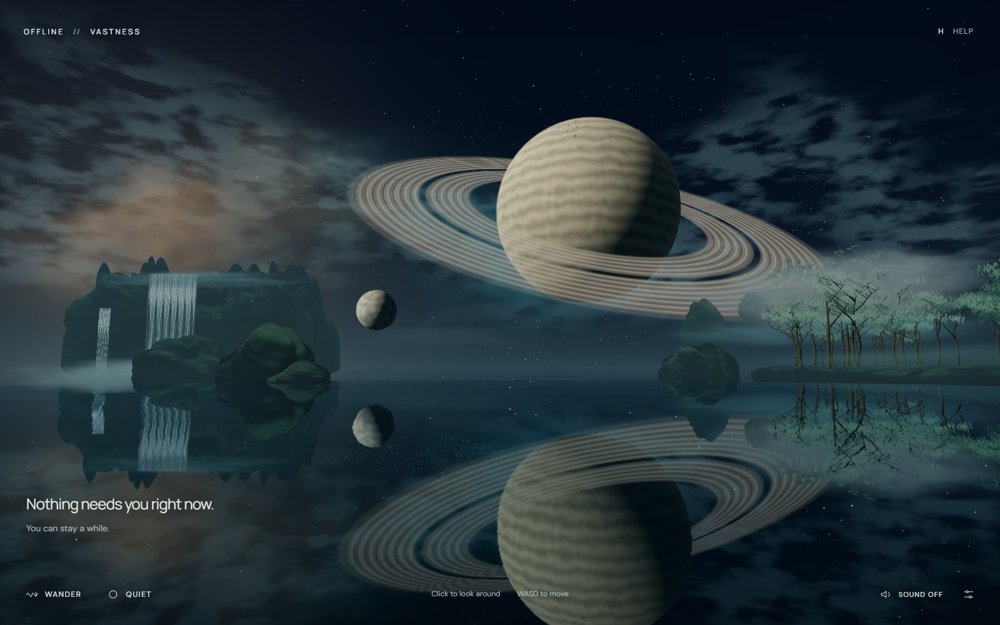

# OFFLINE // VASTNESS

A quiet, freely explorable sanctuary inside a persistent universe. VASTNESS 2.2 opens over a mirror sea. Waterfalls, immense forests, clouds, and living skies share the same world. The stars beyond them remain reachable.

No chapters, timer, score, account, analytics, or mandatory route. Movement always takes over from automatic travel. Sound starts off. A small light you leave behind is saved on this device.

[Public edition](https://offline-vastness.vercel.app) · [Source](https://github.com/Dan-Seo/offline-event-horizon)



## Places to stay

- **The Last Light:** a curved mirror sea, long ripples, bioluminescent wakes, and a rare gossamer visitor reflected with the sky.
- **Moonfall:** a 760-unit descending water curtain, layered cliffs, wet haze, and an occasional quiet moonbow.
- **The Breathing Forest:** recursive trees, swaying leaves and grass, light that responds to stillness, and creatures that gather gently around a resting observer.
- **The Veil:** an enterable three-dimensional cloud field around a suspended garden. Density and openings change slowly.
- **The Living Sky:** thousands of stateful flow-following creatures, local avoidance, and a rare translucent form passing through them.

These places are spatial neighbors on one ocean world. **Explore** opens optional directions to nearby sanctuaries and distant planets. There is no required order. **Wander** glides briefly, rests often, and holds its composition during a nearby beauty event. **Quiet** removes the interface.

## Start comfortably

Choose **한국어 / English** on arrival; the initial choice follows the browser language and a saved choice takes precedence. The optional movement guide responds to actual look, flight, and speed input, with separate touch instructions. The cursor stays free throughout. Skip it, choose Wander immediately, or replay it from Help at any time. Language remains available in Comfort settings.

Beyond the water, **Serein** has wind-shaped dunes and salt basins; **Nacre** has green oceans, pearl clouds, and luminous night coasts. Selene's ice basins and fractures, Ember's warm crustal seams, and the Silent Giant's slow storm bands distinguish the other worlds. Select a planet and use its orbit button or **O** to drift around it; manual input takes over immediately.

At **The Wound**, choose **Release a little matter** or press **T**. Three initial speeds produce falling, bound, and escaping trajectories. Changing gravity affects particles already in flight. This optional experiment preserves the quiet default scene.

Choose **Beyond the horizon · freefall observation** for a separate scientific observation. A radial infaller crosses an ideal Schwarzschild horizon while GPU-integrated null geodesics determine the visible disk and sky. Drag to look, P to pause, and WASD or Esc to restore the exterior flight position. The panel explains the proper-time clock, frequency transfer, and the chosen numerical stop. It makes no claim to show an observed interior or a physical escape. [Equations, references, and limits](docs/RELATIVITY.md).

The five distant hero planets now offer **Closer · into the landscape**. Existing smooth flight continues into Selene's ice canyon, Serein's dune ridges, Ember's cooling caldera, Nacre's reflective lagoon and luminous canopy, or the Silent Giant's cloud tops beneath its rings. These regions stay attached to their planets and remain freely navigable. They are regional environments, not complete planet-wide landing systems. Manual movement interrupts the approach immediately.

## Run

Node 24. No environment variables or service credentials are needed to run the artwork.

```sh
npm ci
npm run dev
```

Development runs at `http://localhost:3000`. To inspect the static production build:

```sh
npm run typecheck
npm test
npm run build
npm start
```

The production preview runs at `http://localhost:4173`. Vercel builds this Next.js static export directly; leave its output-directory override unset.

## Fly

| Input              | Action                                                        |
| ------------------ | ------------------------------------------------------------- |
| W / A / S / D      | Forward / left / backward / right                             |
| Left drag          | Look with damped angular motion; the cursor stays free        |
| Wheel              | Smoothly change the travel-speed multiplier                   |
| Shift / Ctrl       | Boost / precision                                             |
| Q / E              | Roll                                                          |
| Space / X          | Rise / descend                                                |
| Click / right drag | Select a visible celestial body / orbit the selection         |
| Double click / F   | Approach the selected body                                    |
| R / Esc            | Return to the water / cancel automation                       |
| P / H              | Pause simulation / controls help                              |
| M / O / T          | Explore / slow planetary orbit / nearby black-hole experiment |
| B / K              | Wander / quiet                                                |
| G / V              | Hold to attract / repel matter                                |
| N                  | Plant a star                                                  |
| Backquote          | Technical observatory                                         |

Touch: left thumb moves, right thumb looks, pinch changes speed, tap selects, and double tap approaches. Wander, Quiet, sound, and Comfort settings support keyboard focus. All decorative overlays pass pointer events through to the canvas. The application never requests pointer lock. Hovering the free cursor leaves Wander undisturbed; an intentional drag or movement key takes control immediately.

Wander is optional and stays with a place instead of cycling through a destination list. Manual flight or look input immediately cancels automation. Reduced-motion preferences enable gentler camera response and remove CSS animation. Simulation can be paused independently of navigation. Quiet hides the interface and softens motion; Esc or the small restore control brings it back.

## Rendering and scale

Next.js 16, TypeScript, raw Three.js r183, `WebGPURenderer`, TSL, and Web Audio. React owns the small interface; the renderer, input state, camera, and simulation run outside React's render loop. Raw Three.js gives direct control over GPU buffers, compilation, render passes, and streaming without another scene reconciler.

- `universe/input.ts` centralizes keys, temporary drag capture, touch, wheel, blur, and cancellation.
- `flight.ts` handles damped velocity and angular input, distance-aware speed, focus, orbit, forgiving surface clearance, and optional Wander.
- `coordinates.ts` retains double-precision global positions on CPU, subtracts the observer, then compresses the far field logarithmically while preserving angular size.
- `world.ts` maintains 27 neighboring seeded sectors. New sectors arrive as the observer travels; distant sector resources are released. Landmark bodies coexist in the same spatial system.
- `planets.ts` shares procedural terrain, ocean, cloud, atmosphere, aurora, night-light, and ring materials across mesh LODs.
- `nebula.ts` raymarches spatial volumes through a seamless procedural 96³ density texture, with extinction and locally varying color. The camera can enter the volume.
- `stars.ts` combines a distant clustered stellar population with sector stars and local matter for parallax.
- `anomaly.ts` builds the accretion disk and lensed arcs; `engine.ts` adds bounded screen-space distortion and restrained bloom.
- `orbit-model.ts` integrates up to 144 interactive test particles on CPU with fixed 1/120-second velocity-Verlet steps and softened inverse-square gravity. `orbit-experiment.ts` renders their measured position histories. Dense ambient matter remains on GPU; the small experiment uses the same force model on both render backends.
- `relativity-model.ts` contains the Schwarzschild observer and null-ray reference model. The lazy-loaded `relativity.ts` traces the same equations per fragment through TSL, with a capped render target on both WebGPU and WebGL2. `RelativityPanel.tsx` keeps explanatory controls in English and Korean.
- `approaches.ts`, `approach-terrain.ts`, and `approach-water.ts` attach deterministic regional geometry, collision clearance, reflective water, instanced organic forms, and three-dimensional cloud volumes to the existing planetary bodies. They reuse the current flight controller, materials, and floating origin.
- `language.ts`, `ArrivalGuide.tsx`, and `GravityExperiment.tsx` provide English/Korean copy, actual-input onboarding, and the optional experiment. Opening keyboard-driven panels clears held input. Drag capture lasts only for the gesture and is also released on blur or cancellation; the cursor remains visible and unrestricted.
- `matter.ts` maintains positions and velocities in GPU storage buffers, integrating softened fields, tangential motion, damping, and local-domain rebasing without per-frame readback.
- `creation.ts` keeps user-planted stellar seeds in world coordinates and saves the latest 24 in local storage.
- `sanctuaries.ts` coordinates local presence, stillness, and unannounced environmental events. It never changes scenes or takes camera control.
- `sanctuary-water.ts` combines a radially graded spherical ocean cap, a real planar scene reflection, procedural waves, and a small wake history.
- `sanctuary-atmosphere.ts` shares directional high-cloud radiance, local terrain haze, and bounded 3D raymarched mist. Per-view opaque-depth copies stop each ray at visible terrain; integrating the clipped interval avoids bands on nearby trunks. `sanctuary-nature.ts` instances recursive trees, leaves, rocks, grass, and noise-advected waterfall curtains.
- `sanctuary-life.ts` integrates position/velocity storage buffers for a damped shared flow and observer attraction/avoidance. The large translucent visitor is a procedural animated mesh.

High-frequency procedural detail is evaluated on the GPU. Planets have three geometry LODs; the Cathedral has two authored LODs. Material and light topology is shared to reduce shader compilation during streaming. The actual opening is shown as a static poster while the first shader set warms. The hero model loads progressively after flight becomes available. Reflection is warmed after async shader compilation to avoid the r183 nested-render/pending-pipeline race.

## Blender

Original hero geometry is authored by `scripts/build_vastness_assets.py`; editable source is `assets/source/cathedral.blend`.

```sh
blender --background --python scripts/build_vastness_assets.py
```

The Cathedral is a broken orbital gate assembled from arcs, ribs, buttresses, suspended observatory geometry, fins, and faint circuit detail. Blender 5.2.1 CLI was available; Blender MCP was not. The export is normalized, uses glTF Y-up, and has normals and UVs on every primitive. Four materials, four primitives, no image textures.

| LOD  | Vertices | Triangles | GLB bytes |
| ---- | -------: | --------: | --------: |
| High |   20,974 |    31,308 |   863,452 |
| Low  |    7,345 |     8,125 |   288,196 |

See `public/assets/cathedral-report.json`. Reusable hero geometry belongs in Blender; stars, volumes, planets, asteroids, and changing matter are generated at runtime. DM Sans and Manrope are self-hosted with their OFL licenses.

## Quality and fallback

| Tier     | GPU matter particles | Asteroids | Volume steps | DPR cap |
| -------- | -------------------: | --------: | -----------: | ------: |
| ULTRA    |              160,000 |     7,000 |           72 |    1.75 |
| HIGH     |               80,000 |     4,000 |           52 |    1.50 |
| BALANCED |               36,000 |     1,800 |           32 |    1.15 |
| BATTERY  |               12,000 |       650 |           18 |    0.85 |

Local sanctuary volumes use 40/28/20/12 steps and reflection resolution scales of .85/.65/.45/.30 across the four tiers. Living-particle budgets are 8,192/8,192/6,144/4,096. Leaf and grass density also scale. Mobile starts in Battery. Sustained slow frame cadence lowers detail automatically. Battery removes the bloom contribution; the post-processing pass graph remains warm. The hidden technical observatory offers particle, nebula, asteroid, and gravity stress scenarios, with automatic downgrading suspended during intentional stress.

When WebGPU is unavailable, Three.js automatically uses WebGL2. Procedural shaders, reflection, local volumes, and navigation remain available; 5,000 matter particles and 1,200 living particles use reduced CPU force integrators. Missing hero downloads retain a procedural gate. Context/device loss shows a static view and an explicit lighter-graphics retry. Audio is synthesized locally and requires an opt-in gesture; air and tonal levels blend slowly with the local environment.

## Scientific and practical limits

The main universe is physics-inspired interactive art. Dust and released test particles respond to actual force integration. The Newtonian black-hole experiment uses a prescribed absorbing sphere and a finite escape boundary; its gravity slider and starting speeds use artistic units. Its ambient lensing, accretion appearance, atmosphere, clouds, star growth, and companion orbits are artistic approximations. The separate **freefall observation** solves ideal Schwarzschild light geodesics and frequency transfer; its sources, exposure, and color remain illustrative. It omits spin, collapse history, plasma dynamics, and quantum gravity. See the [model document](docs/RELATIVITY.md) for numerical boundaries and validation. Neither mode is an N-body or planet-formation simulation.

The five original sanctuaries and five added planetary regions contain near-surface geometry or cloud volumes and forgiving collision envelopes; vegetation remains permeable. Procedurally streamed planets outside those hero regions support orbital inspection, not full terrain landing. Mirrors use tangent-plane reflection on curved caps, not physically exact curved-water reflection. Sanctuary volumes clip against opaque scene depth, while transparent foliage and water use approximate compositing; the planetary cloud volumes are cheaper box ray marches. There is no multiple-scattering solution. Waterfalls are animated geometric curtains rather than fluid simulation. The large visitor and rare-event timing are authored approximations; small creatures have integrated dynamic state. The distant galactic star field is an angular background population. Persistence is local to the browser and retains up to 24 created lights. Reduced motion softens navigation rather than eliminating all motion; P pauses the simulation. No UE5 edition was built.

This is designed for a restful experience. No therapeutic benefit has been established. No participant study or personally photographed reconstruction has been completed. [Portfolio framing](docs/PORTFOLIO.md), [a small formative-study protocol](docs/FORMATIVE-STUDY.md), and [a future image-reconstruction workflow](docs/RECONSTRUCTION.md) make the next personal contributions concrete without inventing results.

## Verification and deployment

```sh
npm run qa:controls
npm run qa:onboarding
npm run qa:touch-guide
npm run qa:encounters
npm run qa:approaches
npm run qa:devices
npm run qa:resilience
npm run qa:performance
npm run qa
npm run qa:place
npm run test:reconstruction
```

These scripts use installed Chrome through Playwright and real input events against the real renderer. Set `QA_URL` for the deployed site; control, device, resilience, onboarding, encounter, and visual scripts accept `QA_BROWSER=msedge`. `QA_PLACE=moonfall|forest|veil|living-sky` chooses a place for a continuous flight and stillness observation; default is the sea. The encounter suite travels through five planets and the anomaly without teleporting, tests automatic-orbit interruption, and exercises all three release outcomes. Set `QA_BACKEND=webgl` for its fallback pass or `QA_PLACES=serein,nacre` for a shorter route. Reports and actual screenshots go to ignored `artifacts/`. `?qa=1` exposes read-only diagnostics; it does not provide camera teleport or test-only simulation actions. Earlier pre-sanctuary scripts remain as historical records.

See [the 2.2 verification record](docs/QA-2.2.md), [the 2.1 record](docs/QA-2.1.md), and [the 2.0 record](docs/QA-2.0.md). Earlier performance numbers are browser frame intervals and renderer counters. The optional `?qa=1&profile=1` path adds GPU render/compute pass timestamps when supported; these exclude CPU and presentation time. Physical phones, Safari, Firefox, thermal behavior, and long-duration memory stability need additional coverage.

The authenticated Vercel CLI deploys the project with `vercel deploy --prod`. Both `offline-vastness.vercel.app` and the previous address are registered production domains. GitHub source is available, but automatic Git-triggered Vercel deployment is not configured. The earlier timed Event Horizon edition is preserved in the `event-horizon-v1` tag; the current application has no forced progression.
