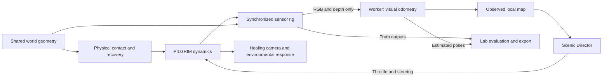

# PILGRIM — release design and model boundary

One world, two lenses. The existing universe, free cursor, walking, planetary approaches, languages and black-hole observation stay in place. PILGRIM is a spring-supported hovercraft, not a replacement camera engine. The ordinary controls are Go, Rest and Carry me somewhere. Research instrumentation lives at `/lab`.

## Information boundary

The craft's dynamics may query the rendered terrain for contact and emergency collision recovery. That is simulated physical contact, not a perception claim. The local planner receives only calibrated RGB-D observations and the resulting local map. It receives no landmark coordinates, world height function, semantic ground truth or ground-truth pose. Renderer normals and semantic labels are exported for evaluation only. Ground truth is joined to estimates by capture ID outside the worker; it is never sent into VO.

The sensor camera shares the craft pose, terrain triangles and object instance transforms with the artwork. A bounded opaque sensor pass excludes bloom, atmospheric compositing and decorative translucent particles. Sensor RGB is a calibrated, explicitly simplified appearance model, rather than a screenshot of the artistic post-processing pipeline. Depth is axial camera depth. Transparent water is modeled as a visible surface in the clear configuration; reflective-water failure conditions invalidate its depth. This is an ideal synthetic RGB-D camera, not a faithful Kinect simulator.



The manual controls interrupt the director before its commands reach the dynamics. The evaluation branch has no return path into estimation or route choice. Sensor rendering runs during Carry and deliberate lab use; ordinary manual riding and flight do not keep it active.

## Baseline, not novel SLAM

The baseline detects Shi–Tomasi corners, tracks 7×7 image patches with three-level pyramidal Lucas–Kanade, checks forward/backward consistency and normalized patch error, associates interpolated inverse depth and estimates a rigid 3D transform with RANSAC and Horn's quaternion absolute-orientation solution. It composes relative estimates in its own initial frame. There is no pose copying, loop closure, global bundle adjustment or global relocalization. Tracking failure starts a new segment; no invented bridge is drawn across a missing interval.

The implementation solves the 2×2 image-gradient system directly. It is not an OpenCV/WASM wrapper. Horn's symmetric 4×4 eigenproblem uses Jacobi rotations and the largest algebraic eigenvalue. Degenerate point sets are rejected. RANSAC draws deterministic non-collinear triples, requires at least eight inliers and a 40% inlier ratio, then refits those inliers. Depth discontinuities are rejected before interpolating inverse depth. Source-to-target point motion is inverted when composing camera motion.

The local map fuses depth points only across valid consecutive visual estimates. On tracking loss it falls back to the current body-relative depth scan and reduces speed. Scenic choices combine observed clearance, slopes, image color/visibility, recent estimated travel and a preference to rest. Appearance-based water/vegetation scores are heuristics, not semantic networks or therapeutic metrics.

ATE uses an unscaled SE(3) least-squares alignment within each tracked segment. RPE compares relative motions over a stated time interval. Never fit scale to hide RGB-D scale error. Degenerate alignment, insufficient pairs, lost tracking and dropped captures are explicit.

Stationary or nearly collinear trajectories do not reliably constrain an alignment rotation. ATE is unavailable when either trajectory has less than 0.05% transverse energy relative to its longest displacement axis; RPE remains available. The trajectory plot displays the latest segment relative to each trajectory's first pose, with no scale fitting. This evaluation-only alignment never feeds the estimator. RPE uses approximately one-second pairs with a maximum 0.26-second sampling tolerance; rotation values are radians in exports and degrees in the panel.

## Scheduling

Rendering and the 120 Hz vehicle integrator are independent of sensor/analysis frequency. Sensors request at most 8 Hz on desktop or 4 Hz on the initial small viewport. Only one capture/worker transaction may be in flight. No stale queue is accumulated; missed capture slots are counted. Maps keep at most 14,000 recent depth points, contact interpolation at most 18,000 nodes, and lab recording at most 3,600 pose pairs. Disabled research and manual flight do not render sensors. Carry uses the same perception worker as the lab; the lab adds visualizations and bounded local recording, not a substitute navigation stack.

Each transaction has one retained physical capture/worker owner and is identified by its generation, request, and capture IDs. Carry accepts an observation only from its current session when the capture timestamp is no more than 0.85 seconds old; reset clears cached director observations and invalidates prior generations. Late successes, transport failures, and errors may settle only their own owner, so they cannot unlock or publish into newer work. There is deliberately no forced timeout that overlaps an indefinitely non-settling platform operation: it can pause analysis until settlement or disposal, but cannot create parallel work or revive stale Carry input.

Sensor RGB and labels use RGBA8 targets; depth and normals use RGBA32F. The combined 24 attachment bytes per sample stay within WebGPU's baseline attachment limit. A capture ID and simulation timestamp identify the simultaneous GPU outputs. RGB uses a seeded mip-filtered triplanar texture and approximate gamma encoding. Depth has no quantization/noise model in CLEAR. Sparse flow is measured feature displacement, not dense ground-truth flow. Camera coordinates for export are x right, y down, z forward; quaternion storage is x/y/z/w and poses map camera to world. Normals use the same camera axes. The IMU is an ideal sensor-rate finite-difference approximation with a local 9.81-unit gravity field, not a high-rate biased hardware model.

The deliberate lab reset is a fixed forest-edge starting fixture. It is the only lab positioning action. Normal Carry does not call it. FOG, LOW_LIGHT, REPETITIVE and REFLECTIVE_WATER change the synthetic observation model; RAIN and DYNAMIC are explicitly image-space corruptions/occlusions. FAST_MOTION increases manual drive speed in the lab. These conditions do not silently change a normal healing session. The map's water/vegetation preferences come from RGB appearance, not the exported semantic truth.

The simulation's contact oracle samples visible terrain triangles through a bounded 3-unit interpolation atlas in the original sanctuaries, and the existing rendered triangle height function in planetary regions. Conservative trunk bounds provide contact rejection. Those privileged queries are isolated in `pilgrim/contact.ts`. They model physical contact, not sensor-based obstacle prediction. A single artistic beauty-event flag can hold a composition; it carries no destination or route coordinates.

Candidate routes are local constant-curvature arcs, not world-space splines between attractions. Their selected curvature is converted to the craft's physical yaw rate at the chosen speed. The planner does not perform global search, guaranteed collision avoidance, learned aesthetic scoring or semantic recognition. Unknown near-field cells are rejected. A lack of a reliable opening leads to a small stationary scan and a long rest, rather than a blind journey. The craft can consequently remain in one area for a long time. Contact recovery is a separate last line of defense.

## Reproducible sensor clips

In `/lab`, **Record 32 sensor frames** captures a bounded, device-local RGB-D sequence. Each image, depth plane, normal plane, semantic plane, IMU sample, truth pose and estimate is paired by the same capture ID before publication. A full clip is about 16 MB uncompressed. Recording stops at 32 frames; reset or a condition change clears the clip. Nothing is uploaded.

**Download RGB-D sequence** exports an ordinary uncompressed TAR containing `manifest.json` and per-frame binary planes. RGB is row-major RGBA8, depth is little-endian Float32 axial z, normals are three little-endian Float32 components, and semantic labels are Uint8. The manifest includes camera intrinsics, fixed body-relative extrinsics, timestamps, seed, conditions, and paired truth/estimated poses. The separate JSON export includes the latest synchronized sensor frame and up to 3,600 trajectory samples.

```sh
npm run replay:rgbd -- path/to/vastness-rgbd-clear.tar
```

This command runs the same RGB-D estimator directly on saved images and depth, outside Three.js. It checks relative pose estimates, tracking status and inlier counts against the captured runtime results. Its first pose starts a fresh gauge; it does not copy the recorded initial estimate. Truth is only joined afterward for evaluation. The dataset is an idealized synthetic observation of shared geometry, not real-world sensor evidence.

A small actual WebGPU capture is retained as `docs/evidence/vastness-3.0/clear-eight-frames.tar.gz`. The replay command also accepts this gzip-compressed TAR. CI checks its seven relative estimates, inlier counts and tracking states; the clip is too short and nearly straight for meaningful aligned ATE or one-second RPE. The longer downloaded sequence and complete run report are the appropriate evaluation sources.

## Vehicle and experience boundaries

The leaf-like craft uses a 120 Hz damped hover spring, bounded horizontal acceleration, steering inertia, surface-normal pitch and slight banking. Land/water contact is continuous. Cliff departures use controlled descent and a small finite lift reserve; there is no infinite flight mode or fuel UI. It rides the original sanctuaries and four solid planetary regions. Planet-scale free flight and Nacre walking remain separate user-controlled ways to travel; selecting an explicit distant approach leaves the craft.

Grass bends around a short fading world-space trail, the existing water reflection receives the hull and wake, and local creatures respond to the shared moving observer. These are restrained artistic responses, not fluid/vegetation biomechanical simulations. Existing rare-event scheduling is preserved; a beauty event can pause scenic motion without stacking a new event. PILGRIM is procedurally authored in Three.js; the existing Cathedral remains the Blender-authored hero asset.

No full global SLAM, loop closure, absolute relocalization, dense optical flow, hardware-calibrated IMU noise, fully reconstructed translucent foliage, global scenic route planning or validated restorative score is implemented. The local map and perception-only route selection are deliberately modest and inspectable.

## Primary references

- [Horn, 1987 — absolute orientation](https://people.csail.mit.edu/bkph/papers/Absolute_Orientation_Scanned.pdf).
- [TUM RGB-D benchmark tools — ATE and RPE](https://cvg.cit.tum.de/data/datasets/rgbd-dataset/tools).
- [OpenCV optical-flow documentation — pyramidal Lucas–Kanade and its assumptions](https://docs.opencv.org/4.13.0/d4/dee/tutorial_optical_flow.html).

Implementation, measured results and remaining limits are recorded separately in the release QA record. No participant results or clinical benefit are claimed.
