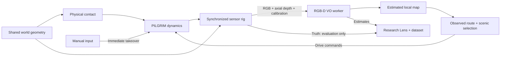
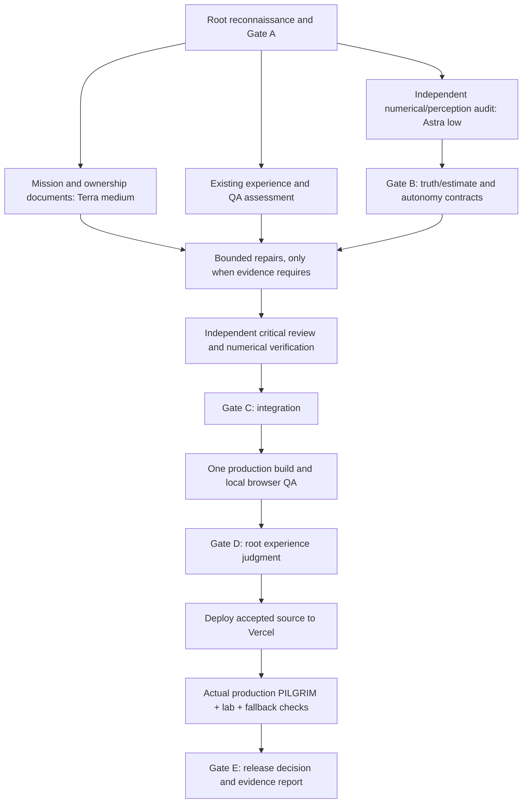

# VASTNESS 3.0 // PILGRIM — mission adoption and release plan

Baseline inspected: `bd13e2a`, 2026-09-10. Repository: `Dan-Seo/offline-event-horizon`. Production: `https://offline-vastness.vercel.app`.

This is a review and completion pass over an existing 3.0 implementation. Existing reports describe earlier runs; they are not evidence that this pass has completed. Preserve accepted implementations and repair consequential contract failures.

## Gate A: architectural map and ownership

| Boundary | Existing owner / surface | Contract |
| --- | --- | --- |
| App and healing UI | `app/`, `components/`, `universe/state.ts`, `language.ts` | React presents controls; high-frequency scene state stays in the engine. `/lab` deliberately enables research. |
| World and renderer | `universe/engine.ts`, `world.ts`, `coordinates.ts`, `planets.ts`, `sanctuary-*.ts`, `sanctuaries.ts`, `approach-*.ts`, `approaches.ts` | Preserve floating origin, planet-local frames, shared terrain/water, reflective passes, living/environmental systems, quality tiers and WebGL2 fallback. |
| Existing navigation and experiments | `input.ts`, `flight.ts`, `walk*.ts`, `matter.ts`, `orbit-*.ts`, `relativity*.ts`, `accretion*.ts` | Preserve manual cancellation, free cursor, planetary approaches, walking and documented physics experiments. |
| Craft | `pilgrim/contact.ts`, `model.ts`, `system.ts`, `craft.ts`, `influence.ts`, `meadow.ts` | Contact may use privileged geometry for actual physics and recovery; controller accepts bounded drive commands. |
| Observation | `perception/rig.ts`, `surfaces.ts`, `runtime.ts`, `types.ts` | Render calibrated shared-geometry RGB-D; match attachments, timestamp and capture ID; bound asynchronous work. |
| Estimation and reconstruction | `perception/math.ts`, `vo.ts`, `map.ts`, `worker.ts` | Estimator receives observed RGB/depth/calibration, never truth pose, labels, destinations or world geometry. Map uses estimated motion. |
| Scenic autonomy | `perception/map.ts`, `pilgrim/director.ts`, `system.ts` | Observed local routes and visual heuristics produce physical steering; pauses and immediate manual takeover are intentional. |
| Evaluation and research | `perception/metrics.ts`, `dataset.ts`, research components, `scripts/replay-rgbd.ts` | Truth joins estimates only for evaluation/export; explicit coordinate conventions and unscaled trajectory alignment. |
| QA and production | `tests/`, `scripts/pilgrim-*.mjs`, `.github/workflows/check.yml`, `next.config.ts`, `vercel.json` | Numerical tests, actual browser interaction and bounded performance evidence, static Next export, verified Vercel alias. |

The research camera exports x-right/y-down/z-forward poses with x/y/z/w quaternion storage. The artwork uses Three.js and existing world/surface transforms. Gate B must validate the conversion and source-to-target inversion rather than relying on documentation alone. The evaluation branch has no authority over estimator or planner state.

## Dependency graph and work waves

- Begin with two useful workers. One owns only mission/instruction documents; the other independently audits existing perception without modifying implementation. They share read access, not write surfaces.
- Root owns this plan and central integration decisions. Implementation repairs receive explicit file ownership before work starts. Reviewer and implementer must differ for critical systems.
- Existing accepted interfaces are the starting contracts. Do not invent a new large sensor, map, or world architecture unless a reproduced defect requires it.
- A repair to perception mathematics must precede final sensor replay and metrics evidence. A repair to runtime/controller coupling must precede journey and lab browser checks.
- Run GPU browser suites serially for interpretable performance results. One build at a time. Initial hardware check showed about 16.6 GiB free RAM and 56% CPU load; readings change and other projects remain active.
- Existing Playwright scripts operate installed Chrome/Edge through real page controls. The connected-browser tool exposed no browser in this session; root must inspect generated visual evidence and actual interaction outcomes rather than claim that unavailable UI control succeeded.

## Acceptance and evidence required for this pass

1. Preserve the generated Next instructions; version-specific local documentation governs framework changes.
2. Produce independent review decisions for consequential perception/dynamics changes, deterministic evidence for math and controller contracts, and actual build/type-check results.
3. Verify ordinary arrival/manual travel avoid active sensor work, Carry uses real observation-derived routes and rests, and manual input takes over immediately.
4. Verify `/lab` attachments and pose pairs synchronize, truth remains separate, controlled failures degrade honestly, and exports/replay retain reproducibility.
5. Measure frame cadence, analysis latency and bounded structures on the stated backend/viewport; distinguish observations from general performance guarantees.
6. Deploy the accepted commit, inspect Vercel readiness/alias, open the production URL through actual browser tests, and retest healing and research views before claiming release completion.
7. Report incomplete/approximate features explicitly. Neither previous screenshots nor previous release reports substitute for this pass's evidence.

## Gate decisions for this pass

- Gate A accepted the existing architecture and bounded repair graph. The mission and optimized orchestration rules are now repository instructions; rebuilding accepted systems is unnecessary.
- Gate B identified two consequential failures: delivery-time freshness admitted old observations into autonomous control, and reset could release an unresolved capture. A separate Astra-low worker repaired those contracts; the original Astra-low reviewer independently returned PASS after inspecting the actual runtime, worker envelope and deterministic race tests. Estimated state remains separate from evaluation truth.
- Gate C accepted generation/request/capture identity, a single owner retained through asynchronous settlement, reset invalidation of cached routes, and capture-time freshness. The independent review passed 24 focused tests and TypeScript; the validation worker passed all 47 tests, exact retained-clip relative-pose replay, and the production build. No numerical estimator or shared world architecture was replaced.
- Gate D inspected current-build healing and Research Lens screenshots and actual Chrome smoke interactions: 9 checks passed, with no runtime/shader errors. The earlier production journey is baseline evidence only. Production journey and backend-specific lab evidence remain required for Gate E.
- Gate E is pending deployment and actual deployed-browser checks. Final results belong in `docs/QA-3.0-HARDENING.md`.
